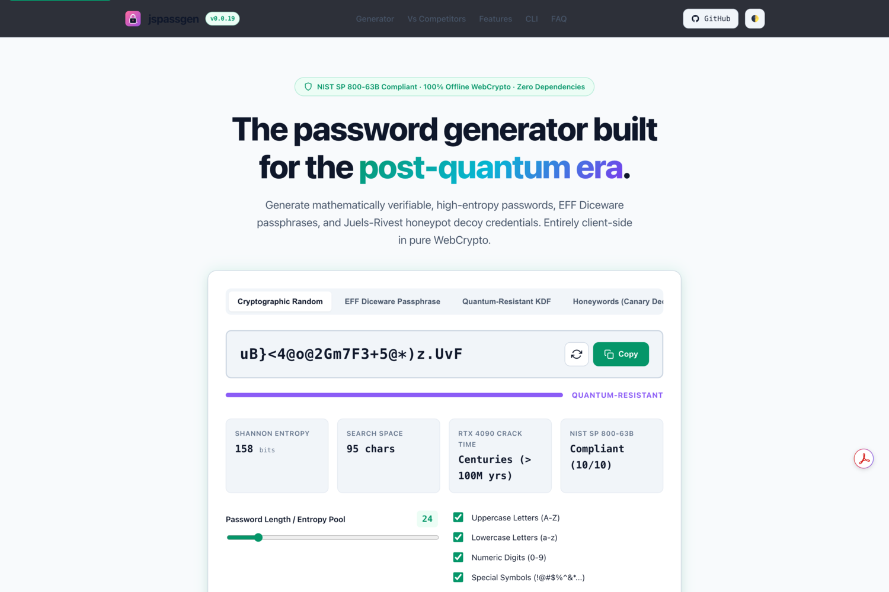

# jspassgen

jspassgen is a cryptographic password and passphrase generator theme for Static Site Generator.
It provides zero-trust client-side entropy estimators, Diceware phrase models, and security audit controls.



## Build

From the repository root:

```sh
ssg build -f themes/jspassgen/ssg.toml
```

The theme uses the local Skeletonic Stylus foundation, same-origin assets, and responsive SVG iconography.

## Accessibility and resilience

- WCAG 2.2 AAA colour-token targets in light and dark schemes
- 44-by-44-pixel controls and visible keyboard focus
- semantic tables with scrollable-region labelling
- reduced-motion, forced-colour, print, no-JavaScript, and no-CSS fallbacks
- same-origin content security policy and no third-party requests

Automated checks are evidence for the tested pages and environments, not a permanent certification. Re-run the repository gates after changing content or colours.

## Security

Every page carries one Content Security Policy, declared in `_layouts/base.html` and identical across all themes in this suite:

```
default-src 'self'; base-uri 'none'; object-src 'none';
script-src 'self'; style-src 'self'; img-src 'self' data:;
font-src 'self'; connect-src 'self'; manifest-src 'self';
form-action 'self' {form_origin}
```

No inline script or inline style is permitted, so the generator extracts both to external files covered by Subresource Integrity. Nothing loads from a third-party origin.

## Licence

MIT.
