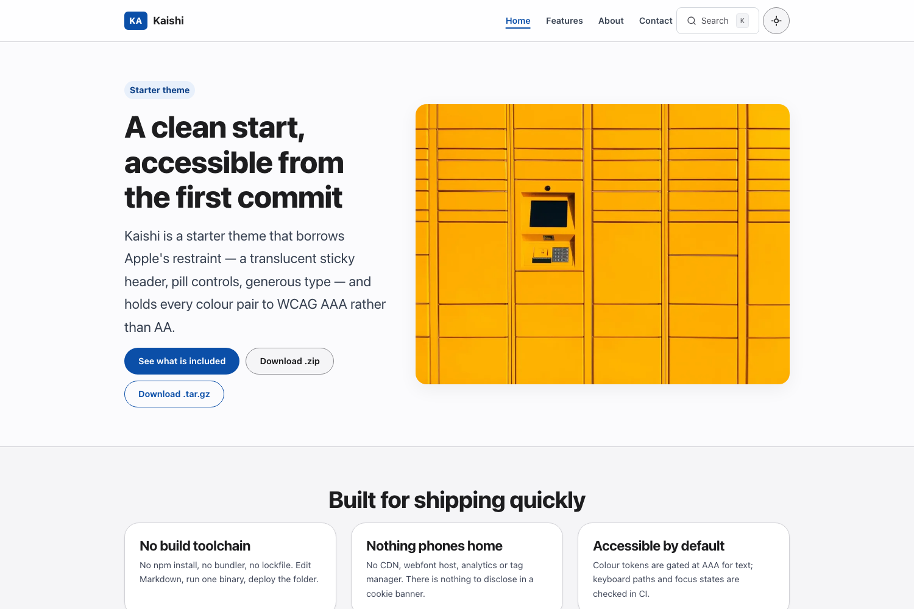

# Kaishi

An Apple-inspired starter theme for Static Site Generator: a translucent
sticky header, pill controls, soft cards and generous type — on a colour
system gated at **WCAG AAA**, not AA.



- **Demo:** <https://themes.static-site-generator.com/kaishi/>
- **Licence:** MIT
- **Requires:** ssg 0.0.50+

## Install

Copy `themes/kaishi/` into your project, point the generator at its
configuration, and build:

```sh
ssg build -f themes/kaishi/ssg.toml
```

There is no package to install and no build step of its own.

## What you get

| Page | Layout |
| --- | --- |
| Home | `index.html` |
| About | `about.html` |
| Features | `features.html` |
| Contact | `contact.html` |
| Not found | `404.html` |
| Anything else | `page.html` |

## Design

Three details carry the look, all of them tokens rather than markup:

- **Translucent header** — the masthead blurs the page behind it, but only
  behind `@supports (backdrop-filter: ...)`. Without support it stays
  opaque, so the contrast pair the gate verifies is the pair that ships.
- **Pill controls** — a 980px radius rather than `50%`, so a wide button
  keeps semicircular ends instead of becoming an ellipse.
- **Soft cards** — a 24px corner and a light shadow instead of a hard border.

## Accessibility

Every colour pair is verified at **AAA (7:1)** for text by
`scripts/contrast.py` in CI, in light *and* dark mode. Dark mode is checked
as its own palette, which is where themes usually fail: a muted grey that
reads well on white is often unreadable on black.

Nothing is loaded from another origin — no CDN, no webfont host, no
analytics.

## Security

Every page carries one Content Security Policy, declared in
`_layouts/base.html` and identical across all themes in this suite:

```
default-src 'self'; base-uri 'none'; object-src 'none';
script-src 'self'; style-src 'self'; img-src 'self' data:;
font-src 'self'; connect-src 'self'; manifest-src 'self';
form-action 'self' {form_origin}
```

No inline script or inline style is permitted, so the generator extracts
both to external files covered by Subresource Integrity. Nothing loads from
a third-party origin.

`form_origin` is the one value you are expected to change. It is set in each
page's front matter and defaults to the placeholder `https://example.com`.
Point it at your own form endpoint before you deploy, or the browser blocks
the POST. If the theme has no form, set it to your own origin and the
directive becomes inert.

## Licence

MIT or Apache-2.0, at your option.
