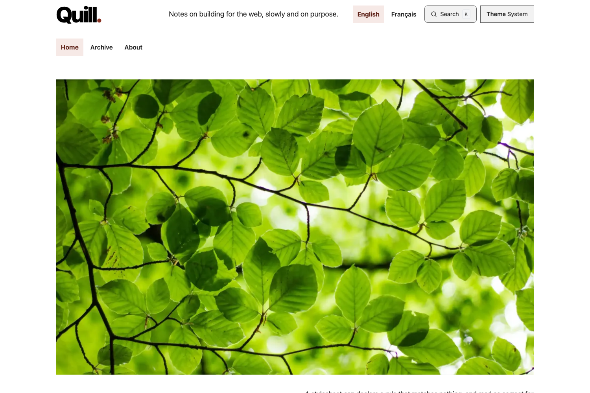

# Quill

An typographic blog theme for [Static Site Generator](https://github.com/sebastienrousseau/static-site-generator).

A large tight-tracked wordmark, full-bleed hero images, two-column post headers, and a deliberately monochrome palette where hierarchy is carried by size and space rather than hue.



**Best for:** Writing-led blogs, essays, changelogs

## What it ships

| | |
| --- | --- |
| Layouts | `index`, `post`, `page`, `404`, plus the header and footer partials |
| Content | A post index, three posts, an archive and an about page |
| Locales | English and French, with a `translation_key` on every page |
| Colour schemes | System, light and dark, chosen by the reader |
| JavaScript | Progressive enhancement only — nothing here is needed to read the blog |

## Accessibility

Every colour pair is verified at **WCAG AAA** before the site builds: 7:1 for
text in both schemes. Borders and focus rings are held to **4.5:1**, which is
stricter than the 3:1 that 1.4.11 asks — that criterion has no AAA level, so
the AA *text* threshold is the strictest defensible bar.

The built pages are then measured in a real browser, because a token can pass
in isolation and still be painted on a ground it was never paired with:

```bash
make check-contrast   # every token pair, light and dark
make check-aaa        # rendered contrast, target size, reflow, focus
```

That covers the computed colour of every text run against its actual
background, every target at 44 by 44 pixels, no horizontal overflow at any
width from 320px up, and no focus ring that another element covers.

## Using it

```bash
ssg build -f themes/quill/ssg.toml
```

Then copy `_layouts/styles.css`, `_layouts/main.js` and
`_layouts/theme-init.js` alongside the output — `ssg` renders templates but
does not copy the assets that sit beside them.

## Security

Every page carries one Content Security Policy, declared in
`_layouts/base.html` and identical across all themes in this suite:

```
default-src 'self'; base-uri 'none'; object-src 'none';
script-src 'self'; style-src 'self'; img-src 'self' data:;
font-src 'self'; connect-src 'self'; manifest-src 'self';
form-action 'self' {form_origin}
```

No inline script or inline style is permitted, so the generator extracts
both to external files covered by Subresource Integrity. Nothing loads from
a third-party origin.

`form_origin` is the one value you are expected to change. It is set in each
page's front matter and defaults to the placeholder `https://example.com`.
Point it at your own form endpoint before you deploy, or the browser blocks
the POST. If the theme has no form, set it to your own origin and the
directive becomes inert.

## Licence

MIT. See [LICENSE](../../LICENSE).
