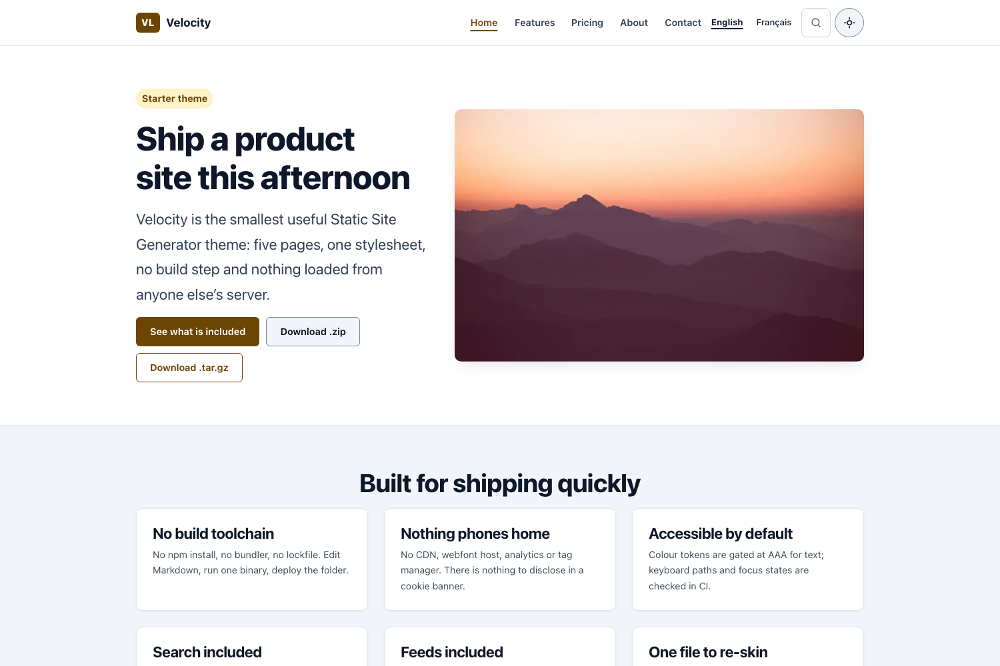

# Velocity

The smallest useful theme in the suite: a product landing page, a features page, pricing, about and contact. No bundler, no lockfile, under 4 KB of JavaScript.



- **Demo:** <https://ssg-themes.github.io/velocity/>
- **Licence:** MIT
- **Requires:** ssg 0.0.50+ — the pricing island does not hydrate on earlier versions

## Install

Copy the theme into your project and build it:

```bash
cp -R themes/velocity my-site
cd my-site
ssg build -f ssg.toml
```

`ssg.toml` carries the site name, description, base URL and the
content/template/output paths. **Change `base_url` and `site_url` before you
deploy** — leaving the defaults is how a site ends up publishing an
`llms.txt` reading `MySsgSite` and JSON-LD pointing at `127.0.0.1`.

Requires **ssg 0.0.50 or later**. Earlier versions do not resolve the layout
named in front matter — every page renders through `page.html` — reject the
`content/content.schema.toml` this theme ships, and drop the extracted
stylesheet on any site published under a sub-path.

## Layouts

| Layout | Used for |
| --- | --- |
| `index` | Product landing: badge, headline, pillar grid |
| `features` | What is included |
| `pricing` | Pricing table example |
| `about` | Architecture and customisation |
| `contact` | Contact form posting to `form_action` |
| `page` | Generic interior page |
| `404` | Not-found page |

Each layout opens with `{{#extends "base"}}` and fills the `main` block.
`base.html` holds the document shell; `header.html` and `footer.html` are
partials included with `{{> header}}`. Changing a menu item is one edit in
one file.

## Front matter

Every page is validated at build time against `content/content.schema.toml`.
A missing or mistyped required field fails the build.

| Field | Purpose |
| --- | --- |
| `title`, `description` | `<title>`, meta description, JSON-LD |
| `layout` | Which layout renders the page |
| `permalink` | Canonical URL for this page |
| `date` | Publication date (ISO 8601) |
| `base_path` | Root-relative prefix for internal links, e.g. `/velocity/` |
| `site_url` | Absolute site root, used in JSON-LD |
| `eyebrow`, `headline`, `lead` | The three elements each page opens with |
| `nav_*` | Marks the current item with `aria-current="page"` |

Page copy is the Markdown body, injected with `{{!content}}`. Note the
`!` — it is the unescaped form. Plain `{{content}}` renders Markdown
output as visible escaped source.

## Customising

The entire design system is the `@layer tokens` block at the top of
`_layouts/styles.css`: colour, type scale and spacing. Change a value, then
run the gate from the repository root:

```bash
make check
```

It parses the token blocks and asserts every declared pair against its WCAG
target in **both** light and dark — 7:1 for text (1.4.6, AAA), 3:1 for
borders and the focus ring (1.4.11). A failing token fails the build, so the
accessibility claim stays true after you re-skin it.

Dark mode is defined three times on purpose: on bare `:root` for the light
default, inside `prefers-color-scheme: dark` guarded by
`:root:not([data-theme="light"])`, and on `:root[data-theme="dark"]`. That
covers explicit light, explicit dark, and the unstamped "follow the system"
state most visitors are in.

## What comes from the generator

These are not theme features; the theme links and skins them.

- Search — injected as an accessible dialog with SRI on its script
- RSS, Atom, JSON Feed, `sitemap.xml`, `robots.txt`, web app manifest
- CycloneDX SBOM, `llms.txt`, asset fingerprinting with integrity hashes

## Known limits

- `{{#each}}` cannot iterate front-matter arrays: the generator
  stringifies metadata before the template engine sees it, so index pages
  list their entries in Markdown rather than looping over content.
- An unresolved `{{tag}}` is a hard build error, not an empty string.
  Guard optional fields with `{{#if field}}…{{/if}}`.

## Licence

MIT. See [LICENSE](../../LICENSE).
