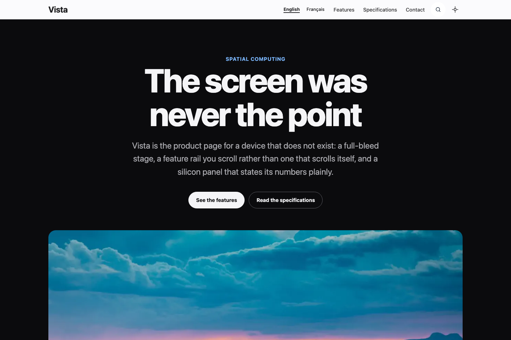

# Vista

A spatial-computing product theme for [Static Site Generator][ssg]: the
front-of-house page a flagship device needs, with none of the motion that
category usually carries.



- **Four pages** — home, features, specifications, contact, plus a 404.
- **No build step.** No `package.json`, no bundler. Hand-authored CSS using
  cascade layers and custom properties.
- **No third-party requests.** No fonts, analytics or CDNs. Everything is
  same-origin, enforced by a strict content security policy.
- **AAA colour.** Every token pair is checked by `scripts/contrast.py` at
  7:1 for text and 3:1 for non-text, in light and dark — including the
  dark stage and the silicon band, which carry their own tokens.

## Requirements

SSG **0.0.50** or newer.

## Usage

```sh
ssg build -f themes/vista/ssg.toml
```

Change `base_url` in `ssg.toml` to your own origin before deploying.

## The feature rail

The rail scrolls; it does not play. Anything that moves for more than five
seconds needs a control to stop it under WCAG 2.2.2, and a list of six
features has no reason to move unasked. It is an ordinary scroll region:

| Reached by | How |
|---|---|
| Trackpad or touch | Ordinary horizontal scroll or drag |
| Keyboard | Tab to the rail, then the arrow keys |
| Pointer | The two buttons above it |

The buttons disable themselves at each end rather than looking live and
swallowing the press. With scripting unavailable the rail still scrolls;
only the buttons stop working, and they are not the only way in.

## Design

Charcoal `#1d1d1f` on near-white, and a true black canvas in dark mode —
softer than pure black on white, which is what makes it read as considered
rather than harsh. The type scale steps by roughly 1.618 at each level, and
the spacing scale uses the same ratio: 24, 40, 64, 104.

The headline sits *above* the environment photograph rather than across it.
Text on a photograph cannot be contrast-checked, and a landscape whose
brightness varies across its width is the worst available ground for it.

## Before you deploy

`content/contact.md` has two fields that must be changed together:
`form_action` and `form_origin`. If they disagree the browser blocks the
POST, silently as far as the visitor can tell.

## Content

The device, the specifications and the figures throughout are illustrative
and describe no real product.

## Security

Every page carries one Content Security Policy, declared in
`_layouts/base.html` and identical across all themes in this suite:

```
default-src 'self'; base-uri 'none'; object-src 'none';
script-src 'self'; style-src 'self'; img-src 'self' data:;
font-src 'self'; connect-src 'self'; manifest-src 'self';
form-action 'self' {form_origin}
```

No inline script or inline style is permitted, so the generator extracts
both to external files covered by Subresource Integrity. Nothing loads from
a third-party origin.

`form_origin` is the one value you are expected to change. It is set in each
page's front matter and defaults to the placeholder `https://example.com`.
Point it at your own form endpoint before you deploy, or the browser blocks
the POST. If the theme has no form, set it to your own origin and the
directive becomes inert.

## Licence

MIT. See [LICENSE](../../LICENSE).

[ssg]: https://github.com/sebastienrousseau/static-site-generator
